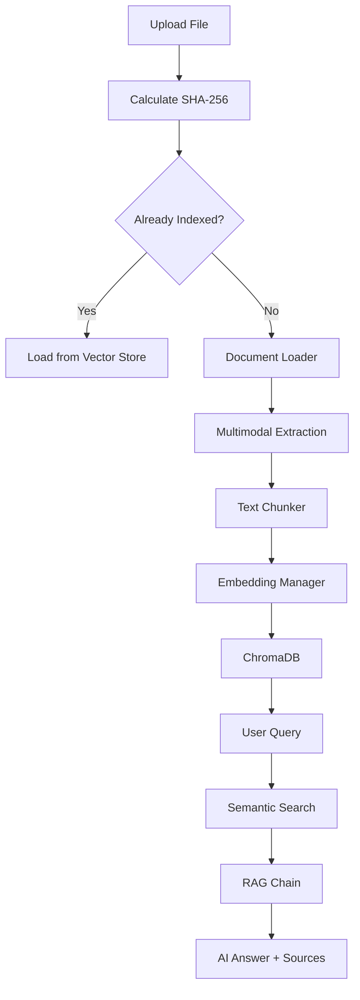

# 🧠 Multimodal Document Intelligence RAG

A production-grade, state-of-the-art Document Q&A system powered by **Google Gemini 1.5 Flash**, **LangChain**, and **ChromaDB**. This system processes PDFs, images, scanned documents, and Office files with intelligent OCR, vision analysis, and semantic retrieval.


## 🌟 Key Features

- **Multimodal Pipeline**: Processes Text, Tables, Diagrams, Flowcharts, and Images.
- **Production Performance**:
    - **SHA-256 Hashing**: Skip already-indexed documents.
    - **Local Embedding Cache**: Save up to 95% on API costs.
    - **Batch Processing**: Efficient API utilization.
    - **Exponential Backoff**: Reliable handling of 429 rate limits.
- **Deep Extraction**: Uses `PyMuPDF`, `pdfplumber`, and `Gemini Vision` for fallback.
- **Premium UI**: Modern Streamlit interface with performance dashboards.
- **Source Citations**: Every answer is grounded with file/page references.

## 🏗️ Architecture



## 🛠️ Setup & Installation

### 1. Prerequisites
- Python 3.10+
- Tesseract OCR (optional for scanned docs)
- Google Gemini API Key ([Get it here](https://aistudio.google.com/apikey))

### 2. Install
```bash
git clone https://github.com/yourusername/multimodal-rag.git
cd multimodal-rag
pip install -r requirements.txt
```

### 3. Environment
Create a `.env` file from the example:
```bash
cp .env.example .env
# Edit .env with your GOOGLE_API_KEY
```

## 🚀 Usage
```bash
streamlit run app.py
```

## 🧪 Testing
```bash
pytest tests/
```

## 🐳 Docker Deployment
```bash
docker build -t multimodal-rag .
docker run -p 8501:8501 --env-file .env multimodal-rag
```

## 📂 Project Structure
- `app.py`: Main UI & Entrypoint.
- `embeddings.py`: Optimized embedding manager (cache/retry).
- `rag_pipeline.py`: Orchestration logic.
- `vector_store.py`: ChromaDB integration.
- `document_loader.py`: Multimodal ingestion pipeline.
- `utils.py`: Security & Hashing helpers.

## 🤝 Contributing
Contributions are welcome! Please read the contribution guide for details on our code of conduct and the process for submitting pull requests.

## 📄 License
This project is licensed under the MIT License.
